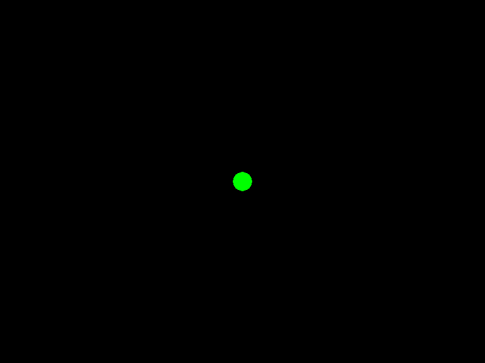
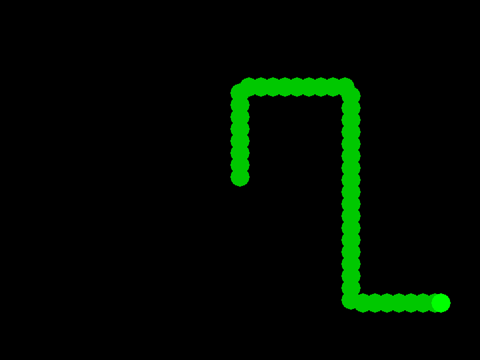
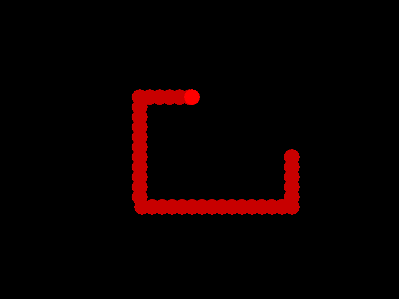
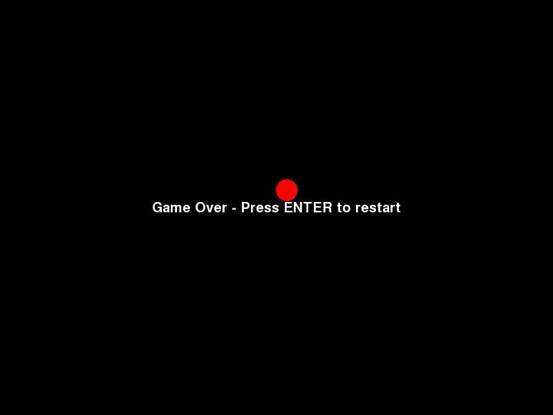
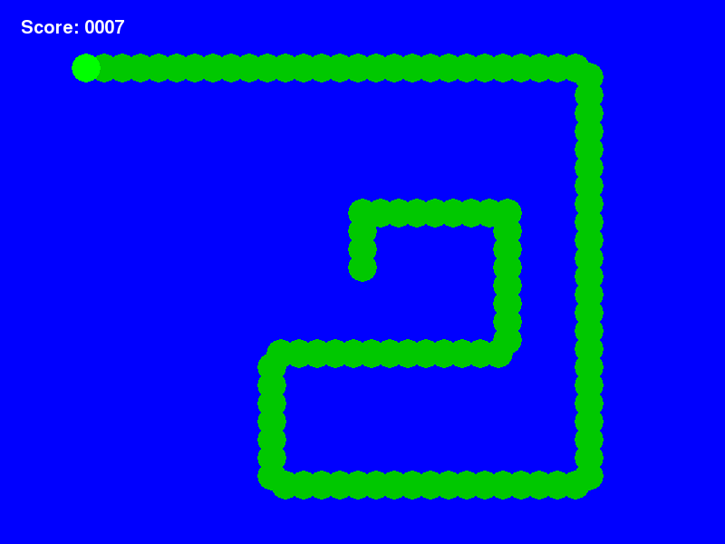

Tutorial 1: Snake Part 1
========================

.. contents::

Introduction
------------

In this tutorial we will explore some of the basic features of serge. We will
cover :doc:`world`, :doc:`zone`, and :doc:`actor` using a simple snake game as
an example.

The code for the game is presented as a single file and at each stage the entire code is show. You can simply
copy the code sample into one file and then execute it to run the game. As we add graphics and sounds you will need
to download the game assets. You can download a ZIP file here. This contains the folders and files needed.

Game
----

The game we will be building is a simple Snake game. In this game you control
an ever growing snake. You turn the snake head left and right and try to avoid
the head hitting the rest of the body.

We are going to start building the game with simple graphics and then, when 
the core game is working we will build in sprites, sounds, and fonts to
make it look more attractive.

Engine Overview
---------------

The basic structure of a serge game revolves around the main :doc:`engine`. 
The engine runs the game. 

Most of what happens in a game, the logic etc, is controlled by various actors. 
Actors live in worlds and worlds are divided into zones. Actors have visuals which
are how they appear to the player.

Finally, the engine has a renderer, which handles drawing the actor's visuals to the screen.
Rendering happens on one or more layers. This allows you to control which actors are painted
in front of which, eg to put the player in front of the background.

.. graphviz::

    digraph foo {
        engine -> world [label="∞"];
        world -> zone [label="∞"];
        zone -> actor [label="∞"];
        actor -> visual [label="1"];
        engine -> renderer [label="1"];
        renderer -> layer [label="∞"];
        engine -> mouse [label="1"];
        engine -> keyboard [label="1"];
    }

Setting Things Up Quickly
-------------------------

You have a fair amount of flexibility in how you configure your engine, but for this 
example we will use a simple default setup which includes,

* a single world, called *lab*, with a single zone
* three rendering layers (called *back*, *middle* and *front*)

Here is the code:

.. code-block:: python
    :linenos:

    import serge.blocks.utils
        
    engine = serge.blocks.utils.getSimpleSetup(800, 600)
    engine.run(60)
    
When you run this you should see some logging appear in the console and then a blank window
will appear. 

The *getSimpleSetup* call returns an engine which will render to a screen of size 800x600. The
call to *engine.run* then runs the engine at 60 frames per second.

Adding The Snake's Head
-----------------------

    
Ok, let's now add the head of the snake. There will be a fail amount of logic associated
with the snake so we normally want to encapsulate this in an actor. To begin with we 
will create the head as a simple circle using the following code.

.. code-block:: python
    :linenos:
    
    import serge.actor
    import serge.blocks.visualblocks
    import serge.blocks.utils
        
    class Snake(serge.actor.Actor):
        """Represents the snake"""
        
        def __init__(self):
            """Initialise the snake"""
            super(Snake, self).__init__('snake', 'snake-head')
            self.visual = serge.blocks.visualblocks.Circle(16, (0,255,0))
            self.setLayerName('middle')

    # Create the engine
    engine = serge.blocks.utils.getSimpleSetup(800, 600)
    world = engine.getWorld('lab')

    # Create the snake
    snake = Snake()
    world.addActor(snake)
    snake.moveTo(400, 300)

    # Run the game
    engine.run(60)

When you run this you should see a green circle in the middle of the screen. This is the snakes
head. The graphic comes from the line:

.. code-block:: python
    
    self.visual = serge.blocks.visualblocks.Circle(16, (0,255,0))
    
This sets the visual representation of the actor to be a green circle with a radius of 16 pixels.
Later on we will replace this with a sprite but for now let's keep it simple.

Moving The Head
---------------

Now it is time to move the snake's head. 

The engine will call the *updateActor* method on an actors in the currently active world every
timestep. This is the normal way that we perform any game logic and so we will use it to move
the snake.

We need to give the snake a certain direction, which we set up in the *__init__* method. There
is a *block* that we can make use of for cardinal directions.

.. code-block:: python
    :linenos:
    :emphasize-lines: 4, 14, 16-21 
    
    import serge.actor
    import serge.blocks.visualblocks
    import serge.blocks.utils
    import serge.blocks.directions
        
    class Snake(serge.actor.Actor):
        """Represents the snake"""
        
        def __init__(self):
            """Initialise the snake"""
            super(Snake, self).__init__('snake', 'snake-head')
            self.visual = serge.blocks.visualblocks.Circle(16, (0,255,0))
            self.setLayerName('middle')
            self.current_direction = serge.blocks.directions.N
            
        def updateActor(self, interval, world):
            """Update the snake"""
            super(Snake, self).updateActor(interval, world)
            #
            offset = 5*serge.blocks.directions.getVectorFromCardinal(self.current_direction)
            self.move(*offset)

    # Create the engine
    engine = serge.blocks.utils.getSimpleSetup(800, 600)
    world = engine.getWorld('lab')

    # Create the snake
    snake = Snake()
    world.addActor(snake)
    snake.moveTo(400, 300)

    # Run the game
    engine.run(60)

Now the snake's head should gradually move up the screen. This is going *north* because we 
chose this as the current direction in the *__init__* method. The *getVectorFromCardinal* function
returns a *Vec2d* so we can multiply it by any constant to create the right length. You can
experiment with the number 5 to adjust the difficulty of the game.

**Note** Always remember to call the base class methods (ie using *super*) for methods like *updateActor*.

Interacting With The Snake
--------------------------

So far the snake is just going forward with no input from the user. Let's now allow the user to
move the head around. We do this by looking for keyboard input. 

The engine has a keyboard object and we can use this to check. Note that for efficiency it is
best to get hold of the keyboard object and anything else you may need in the *addedToWorld* method
of an actor. This method is called just after the actor is added to the world and is a great
place to do initialisation. It is usually better to do things here rather than in the *__init__* method
because at *__init__* you do not know anything about the world you are in.

.. code-block:: python
    :linenos:
    :emphasize-lines: 1-3, 19-23, 28-40
    
    import pygame

    import serge.engine
    import serge.actor
    import serge.blocks.visualblocks
    import serge.blocks.utils
    import serge.blocks.directions
        
    class Snake(serge.actor.Actor):
        """Represents the snake"""
        
        def __init__(self):
            """Initialise the snake"""
            super(Snake, self).__init__('snake', 'snake-head')
            self.visual = serge.blocks.visualblocks.Circle(16, (0,255,0))
            self.setLayerName('middle')
            self.current_direction = serge.blocks.directions.N
        
        def addedToWorld(self, world):
            """The snake was added to the world"""
            super(Snake, self).addedToWorld(world)
            #
            self.keyboard = serge.engine.CurrentEngine().getKeyboard()
            
        def updateActor(self, interval, world):
            """Update the snake"""
            super(Snake, self).updateActor(interval, world)
            #
            # Move the head
            if self.keyboard.isClicked(pygame.K_LEFT):
                rotation = +90
            elif self.keyboard.isClicked(pygame.K_RIGHT):
                rotation = -90
            else:
                rotation = 0
            #
            # Change direction
            if rotation:
                current_angle = serge.blocks.directions.getAngleFromCardinal(self.current_direction)
                self.current_direction = serge.blocks.directions.getCardinalFromAngle(current_angle+rotation)
            #
            # Move
            offset = 5*serge.blocks.directions.getVectorFromCardinal(self.current_direction)
            self.move(*offset)

    # Create the engine
    engine = serge.blocks.utils.getSimpleSetup(800, 600)
    world = engine.getWorld('lab')

    # Create the snake
    snake = Snake()
    world.addActor(snake)
    snake.moveTo(400, 300)

    # Run the game
    engine.run(60)

You should now be able to direct the snake's head using the left and right arrow keys.
Notice that we use the *isClicked* method of the keyboard. This means that the user has
to press and release the key before we will turn the snake. We will see later that 
we can use the *isDown* to create a different feel to the game.

Leaving A Trail
---------------

    
So far the snake is just a head. Let's add a body to it now.

The body of the snake will be made up of a series of segments. We should lay a new
segment down each time we have moved a certain distance. However, we cannot just count
up how far the head has gone since the player may change direction at any time.

So the algorithm is:

* Add a new segment to begin with
* Each iteration check if adding a new segment would overlap the last
* If it overlaps do nothing
* It if doesn't overlap then add it

Let's look at the code.

.. code-block:: python
    :linenos:
    :emphasize-lines: 9, 45-56

    import pygame

    import serge.engine
    import serge.actor
    import serge.blocks.visualblocks
    import serge.blocks.utils
    import serge.blocks.directions
        
    class Snake(serge.actor.CompositeActor):
        """Represents the snake"""
        
        def __init__(self):
            """Initialise the snake"""
            super(Snake, self).__init__('snake', 'snake-head')
            self.visual = serge.blocks.visualblocks.Circle(16, (0,255,0))
            self.setLayerName('middle')
            self.current_direction = serge.blocks.directions.N
        
        def addedToWorld(self, world):
            """The snake was added to the world"""
            super(Snake, self).addedToWorld(world)
            #
            self.keyboard = serge.engine.CurrentEngine().getKeyboard()
            
        def updateActor(self, interval, world):
            """Update the snake"""
            super(Snake, self).updateActor(interval, world)
            #
            # Move the head
            if self.keyboard.isClicked(pygame.K_LEFT):
                rotation = +90
            elif self.keyboard.isClicked(pygame.K_RIGHT):
                rotation = -90
            else:
                rotation = 0
            #
            # Change direction
            if rotation:
                current_angle = serge.blocks.directions.getAngleFromCardinal(self.current_direction)
                self.current_direction = serge.blocks.directions.getCardinalFromAngle(current_angle+rotation)
            #
            # Move
            offset = 5*serge.blocks.directions.getVectorFromCardinal(self.current_direction)
            self.move(*offset)
            #
            # Add a new segment if needed
            if not self.getChildren() or self.getDistanceFrom(self.getChildren()[-1]) > 16:
                self.addSegment()
                
        def addSegment(self):
            """Add a new body segment"""
            segment = serge.actor.Actor('segment')
            segment.visual = serge.blocks.visualblocks.Circle(16, (0,200,0))
            segment.setLayerName('middle')
            segment.moveTo(self.x, self.y)
            self.addChild(segment)

    # Create the engine
    engine = serge.blocks.utils.getSimpleSetup(800, 600)
    world = engine.getWorld('lab')

    # Create the snake
    snake = Snake()
    world.addActor(snake)
    snake.moveTo(400, 300)

    # Run the game
    engine.run(60)
    
Notice on line 9 we changed the *Actor* to a *CompositeActor*. A *CompositeActor* is just like an actor
but it can have child actors also. This helps keep track of the segments and means that when we add 
a segment as a child it will be added to the same world.

We check the distance from the last child using the *getDistanceFrom* method. You can try different 
values than 16 to play around with how the tail looks.

Hitting The Body
----------------  

So far the game is easy. You can run over the tail as many times as you like. So now let's make that 
kill the snake.

We can use the *getDistanceFrom* method of the head to check if it ever collides with a part of the body.

.. code-block:: python
    :linenos:
    :emphasize-lines: 49-52, 62-76

    import pygame

    import serge.engine
    import serge.actor
    import serge.blocks.visualblocks
    import serge.blocks.utils
    import serge.blocks.directions
        
    class Snake(serge.actor.CompositeActor):
        """Represents the snake"""
        
        def __init__(self):
            """Initialise the snake"""
            super(Snake, self).__init__('snake', 'snake-head')
            self.visual = serge.blocks.visualblocks.Circle(16, (0,255,0))
            self.setLayerName('middle')
            self.current_direction = serge.blocks.directions.N
        
        def addedToWorld(self, world):
            """The snake was added to the world"""
            super(Snake, self).addedToWorld(world)
            #
            self.keyboard = serge.engine.CurrentEngine().getKeyboard()
            
        def updateActor(self, interval, world):
            """Update the snake"""
            super(Snake, self).updateActor(interval, world)
            #
            # Move the head
            if self.keyboard.isClicked(pygame.K_LEFT):
                rotation = +90
            elif self.keyboard.isClicked(pygame.K_RIGHT):
                rotation = -90
            else:
                rotation = 0
            #
            # Change direction
            if rotation:
                current_angle = serge.blocks.directions.getAngleFromCardinal(self.current_direction)
                self.current_direction = serge.blocks.directions.getCardinalFromAngle(current_angle+rotation)
            #
            # Move
            offset = 5*serge.blocks.directions.getVectorFromCardinal(self.current_direction)
            self.move(*offset)
            #
            # Add a new segment if needed
            if not self.getChildren() or self.getDistanceFrom(self.getChildren()[-1]) > 16:
                self.addSegment()
            #
            # Check if we hit the body
            if self.hitBody():
                self.initiateDeathAnimation()
                
        def addSegment(self):
            """Add a new body segment"""
            segment = serge.actor.Actor('segment')
            segment.visual = serge.blocks.visualblocks.Circle(16, (0,200,0))
            segment.setLayerName('middle')
            segment.moveTo(self.x, self.y)
            self.addChild(segment)

        def hitBody(self):
            """Return True if the head has hit the body
            
            Look to see if we overlap with any body segment except the last
            (we are allowed to overlap the last since we just put it down)
            
            """
            for segment in self.getChildren()[:-1]:
                if self.getDistanceFrom(segment) < 16:
                    return True
            return False
            
        def initiateDeathAnimation(self):
            """Begin showing the death of the snake"""
            self.log.info('Snake died!')
            
            
    # Create the engine
    engine = serge.blocks.utils.getSimpleSetup(800, 600)
    world = engine.getWorld('lab')

    # Create the snake
    snake = Snake()
    world.addActor(snake)
    snake.moveTo(400, 300)

    # Run the game
    engine.run(60)

    
Right now the snake actually doesn't die it just logs to the console. For the death animation, lets 
turn the body red and then gradually remove body parts until we get to the head. 

Now for this kind of animation you want it to take a while to show. If you implement this in the 
*upateActor* method then it might happen pretty quickly since that is called 60 times a second.
We can use a timed callback to do this where we can control how often it is called.

Callbacks fall under a category called *behaviours*. These are generally useful kinds of activities
that can apply to any actors. To utilize *behaviours* you create a *BehaviourManager*, which is just
a special actor, and then use it to assign behaviours.

.. code-block:: python
    :linenos:
    :emphasize-lines: 19, 26-27, 47, 82-95

    import pygame

    import serge.engine
    import serge.actor
    import serge.blocks.visualblocks
    import serge.blocks.utils
    import serge.blocks.directions
    import serge.blocks.behaviours
        
    class Snake(serge.actor.CompositeActor):
        """Represents the snake"""
        
        def __init__(self):
            """Initialise the snake"""
            super(Snake, self).__init__('snake', 'snake-head')
            self.visual = serge.blocks.visualblocks.Circle(16, (0,255,0))
            self.setLayerName('middle')
            self.current_direction = serge.blocks.directions.N
            self.is_dying = False

        def addedToWorld(self, world):
            """The snake was added to the world"""
            super(Snake, self).addedToWorld(world)
            #
            self.keyboard = serge.engine.CurrentEngine().getKeyboard()
            self.manager = serge.blocks.behaviours.BehaviourManager('manager', 'behaviour-manager')
            world.addActor(self.manager)
            
        def updateActor(self, interval, world):
            """Update the snake"""
            super(Snake, self).updateActor(interval, world)
            #
            # Move the head
            if self.keyboard.isClicked(pygame.K_LEFT):
                rotation = +90
            elif self.keyboard.isClicked(pygame.K_RIGHT):
                rotation = -90
            else:
                rotation = 0
            #
            # Change direction
            if rotation:
                current_angle = serge.blocks.directions.getAngleFromCardinal(self.current_direction)
                self.current_direction = serge.blocks.directions.getCardinalFromAngle(current_angle+rotation)
            #
            # Move
            if not self.is_dying:
                offset = 5*serge.blocks.directions.getVectorFromCardinal(self.current_direction)
                self.move(*offset)
                #
                # Add a new segment if needed
                if not self.getChildren() or self.getDistanceFrom(self.getChildren()[-1]) > 16:
                    self.addSegment()
                #
                # Check if we hit the body
                if self.hitBody():
                    self.initiateDeathAnimation()
                
        def addSegment(self):
            """Add a new body segment"""
            segment = serge.actor.Actor('segment')
            segment.visual = serge.blocks.visualblocks.Circle(16, (0,200,0))
            segment.setLayerName('middle')
            segment.moveTo(self.x, self.y)
            self.addChild(segment)

        def hitBody(self):
            """Return True if the head has hit the body
            
            Look to see if we overlap with any body segment except the last
            (we are allowed to overlap the last since we just put it down)
            
            """
            for segment in self.getChildren()[:-1]:
                if self.getDistanceFrom(segment) < 16:
                    return True
            return False
            
        def initiateDeathAnimation(self):
            """Begin showing the death of the snake"""
            self.log.info('Snake died!')
            self.animation = self.manager.assignBehaviour(self, 
                serge.blocks.behaviours.TimedCallback(1000/len(self.getChildren()), self.removeTail), 'death-animation')
            self.is_dying = True
            for segment in self.getChildren():
                segment.visual.colour = (200, 0, 0)
            self.visual.colour = (255, 0, 0)
                
        def removeTail(self, world, actor, interval):
            """Remove part of the tail"""
            self.log.debug('Removing part of the tail')
            if self.getChildren():
                self.removeChild(self.getChildren()[0])
            else:
                self.animation.markComplete()
            
    # Create the engine
    engine = serge.blocks.utils.getSimpleSetup(800, 600)
    world = engine.getWorld('lab')

    # Create the snake
    snake = Snake()
    world.addActor(snake)
    snake.moveTo(400, 300)

    # Run the game
    engine.run(60)

There is a bit of housekeeping we have to do here. On line 19 we create a new property *is_dying* which we will set 
when the snake is dying. When this is true we do not want to move the snake, add bodies or check for death (again) so
we protect some of the lines in the *updateActor* method to prevent them being called.

The reset of the updates create the *manager* and then use it to assign the *callback*. We call the *removeTail*
method to gradually remove our children. The time interval is set to make sure if takes about a second
to remove the whole tail. When it is done it calls the *markComplete*
method on the *behaviour* to tell the engine that it can be discarded as we wont need it again.

Restarting The Game
-------------------

    
There isn't anything to do after you die now so let's add some text and a way to restart.

.. code-block:: python
    :linenos:
    :emphasize-lines: 29-33, 64-66, 105-113

    import pygame

    import serge.engine
    import serge.actor
    import serge.blocks.visualblocks
    import serge.blocks.utils
    import serge.blocks.directions
    import serge.blocks.behaviours
        
    class Snake(serge.actor.CompositeActor):
        """Represents the snake"""
        
        def __init__(self):
            """Initialise the snake"""
            super(Snake, self).__init__('snake', 'snake-head')
            self.visual = serge.blocks.visualblocks.Circle(16, (0,255,0))
            self.setLayerName('middle')
            self.current_direction = serge.blocks.directions.N
            self.is_dying = False

        def addedToWorld(self, world):
            """The snake was added to the world"""
            super(Snake, self).addedToWorld(world)
            #
            self.keyboard = serge.engine.CurrentEngine().getKeyboard()
            self.manager = serge.blocks.behaviours.BehaviourManager('manager', 'behaviour-manager')
            world.addActor(self.manager)
            #
            self.restart_text = serge.blocks.utils.addVisualActorToWorld(world, 'text', 'restart',
                serge.visual.Text('Game Over - Press ENTER to restart', (255, 255, 255), font_size=20),
                layer_name='front',
                center_position=(400, 300))
            self.restart_text.visible = False
            
        def updateActor(self, interval, world):
            """Update the snake"""
            super(Snake, self).updateActor(interval, world)
            #
            # Move the head
            if self.keyboard.isClicked(pygame.K_LEFT):
                rotation = +90
            elif self.keyboard.isClicked(pygame.K_RIGHT):
                rotation = -90
            else:
                rotation = 0
            #
            # Change direction
            if rotation:
                current_angle = serge.blocks.directions.getAngleFromCardinal(self.current_direction)
                self.current_direction = serge.blocks.directions.getCardinalFromAngle(current_angle+rotation)
            #
            # Move
            if not self.is_dying:
                offset = 5*serge.blocks.directions.getVectorFromCardinal(self.current_direction)
                self.move(*offset)
                #
                # Add a new segment if needed
                if not self.getChildren() or self.getDistanceFrom(self.getChildren()[-1]) > 16:
                    self.addSegment()
                #
                # Check if we hit the body
                if self.hitBody():
                    self.initiateDeathAnimation()
            elif self.animation.isComplete():
                if self.keyboard.isClicked(pygame.K_KP_ENTER) or self.keyboard.isClicked(pygame.K_RETURN):
                    self.restartGame()
                
        def addSegment(self):
            """Add a new body segment"""
            segment = serge.actor.Actor('segment')
            segment.visual = serge.blocks.visualblocks.Circle(16, (0,200,0))
            segment.setLayerName('middle')
            segment.moveTo(self.x, self.y)
            self.addChild(segment)

        def hitBody(self):
            """Return True if the head has hit the body
            
            Look to see if we overlap with any body segment except the last
            (we are allowed to overlap the last since we just put it down)
            
            """
            for segment in self.getChildren()[:-1]:
                if self.getDistanceFrom(segment) < 16:
                    return True
            return False
            
        def initiateDeathAnimation(self):
            """Begin showing the death of the snake"""
            self.log.info('Snake died!')
            self.animation = self.manager.assignBehaviour(self, 
                serge.blocks.behaviours.TimedCallback(1000/len(self.getChildren()), self.removeTail), 'death-animation')
            self.is_dying = True
            for segment in self.getChildren():
                segment.visual.colour = (200, 0, 0)
            self.visual.colour = (255, 0, 0)
                
        def removeTail(self, world, actor, interval):
            """Remove part of the tail"""
            self.log.debug('Removing part of the tail')
            if self.getChildren():
                self.removeChild(self.getChildren()[0])
            else:
                self.animation.markComplete()
                self.restart_text.visible = True
        
        def restartGame(self):
            """Restart the game"""
            self.is_dying = False
            self.restart_text.visible = False
            self.visual.colour = (0,255,0)
            self.current_direction = serge.blocks.directions.N
            self.moveTo(400, 300)
            
    # Create the engine
    engine = serge.blocks.utils.getSimpleSetup(800, 600)
    world = engine.getWorld('lab')

    # Create the snake
    snake = Snake()
    world.addActor(snake)
    snake.moveTo(400, 300)

    # Run the game
    engine.run(60)

We create some text in the *addedToWorld* method. Note how we use the *front* layer to make sure that the text appears
before anything else on the screen. We set the *visible* property to *False* initially because we do not want
it to show until the end of the game.

Then in the *updateActor* method we check for the keypress when we are dying *and* when the animation has completed.
We do not want to allow the user to press enter before the snake is completely cleaned up.

When the user does press enter then we use the *restartGame* method to clean up all the flags and this starts
everything over again.

Minor Polishing
---------------

    
Ok, let's take a bit of time polish things up a bit here with a number of changes.

* Add a background to the display
* Allow the user to press ESCAPE to quit the game at any time
* Kill the snake if it goes off the screen
* Keep score of how long the user survived

.. code-block:: python
    :linenos:
    :emphasize-lines: 9, 36-47, 52-55, 82-84, 109-111, 138

    import pygame

    import serge.engine
    import serge.actor
    import serge.blocks.visualblocks
    import serge.blocks.utils
    import serge.blocks.directions
    import serge.blocks.behaviours
    import serge.blocks.actors
        
    class Snake(serge.actor.CompositeActor):
        """Represents the snake"""
        
        def __init__(self):
            """Initialise the snake"""
            super(Snake, self).__init__('snake', 'snake-head')
            self.visual = serge.blocks.visualblocks.Circle(16, (0,255,0))
            self.setLayerName('middle')
            self.current_direction = serge.blocks.directions.N
            self.is_dying = False

        def addedToWorld(self, world):
            """The snake was added to the world"""
            super(Snake, self).addedToWorld(world)
            #
            self.keyboard = serge.engine.CurrentEngine().getKeyboard()
            self.manager = serge.blocks.behaviours.BehaviourManager('manager', 'behaviour-manager')
            world.addActor(self.manager)
            #
            # Text to display when the game is over
            self.restart_text = serge.blocks.utils.addVisualActorToWorld(world, 'text', 'restart',
                serge.visual.Text('Game Over - Press ENTER to restart', (255, 255, 255), font_size=20),
                layer_name='front',
                center_position=(400, 300))
            self.restart_text.visible = False
            #
            # A background for the game
            self.bg = serge.blocks.utils.addVisualActorToWorld(world, 'bg', 'bg',
                serge.blocks.visualblocks.Rectangle((800, 600), (0,0,255)),
                layer_name='back',
                center_position=(400, 300))
            #
            # Text to show the score
            self.score = serge.blocks.utils.addActorToWorld(world, 
                serge.blocks.actors.NumericText('text', 'score', 'Score: %04d', 
                    (255, 255, 255), font_size=20, value=0, align='left'),
                layer_name='front',
                center_position=(80, 30))
            
        def updateActor(self, interval, world):
            """Update the snake"""
            super(Snake, self).updateActor(interval, world)
            #
            # Quit if requested
            if self.keyboard.isClicked(pygame.K_ESCAPE):
                serge.engine.CurrentEngine().stop()
            #
            # Move the head
            if self.keyboard.isClicked(pygame.K_LEFT):
                rotation = +90
            elif self.keyboard.isClicked(pygame.K_RIGHT):
                rotation = -90
            else:
                rotation = 0
            #
            # Change direction
            if rotation:
                current_angle = serge.blocks.directions.getAngleFromCardinal(self.current_direction)
                self.current_direction = serge.blocks.directions.getCardinalFromAngle(current_angle+rotation)
            #
            # Move
            if not self.is_dying:
                offset = 5*serge.blocks.directions.getVectorFromCardinal(self.current_direction)
                self.move(*offset)
                #
                # Add a new segment if needed
                if not self.getChildren() or self.getDistanceFrom(self.getChildren()[-1]) > 16:
                    self.addSegment()
                #
                # Check if we hit the body
                if self.hitBody() or self.offScreen():
                    self.initiateDeathAnimation()
                #
                # Increase score
                self.score.value += interval/1000.0
            elif self.animation.isComplete():
                if self.keyboard.isClicked(pygame.K_KP_ENTER) or self.keyboard.isClicked(pygame.K_RETURN):
                    self.restartGame()
                
        def addSegment(self):
            """Add a new body segment"""
            segment = serge.actor.Actor('segment')
            segment.visual = serge.blocks.visualblocks.Circle(16, (0,200,0))
            segment.setLayerName('middle')
            segment.moveTo(self.x, self.y)
            self.addChild(segment)

        def hitBody(self):
            """Return True if the head has hit the body
            
            Look to see if we overlap with any body segment except the last
            (we are allowed to overlap the last since we just put it down)
            
            """
            for segment in self.getChildren()[:-1]:
                if self.getDistanceFrom(segment) < 16:
                    return True
            return False
            
        def offScreen(self):
            """Return True if we are off the screen"""
            return self.x < 0 or self.x > 800 or self.y < 0 or self.y > 600
            
        def initiateDeathAnimation(self):
            """Begin showing the death of the snake"""
            self.log.info('Snake died!')
            self.animation = self.manager.assignBehaviour(self, 
                serge.blocks.behaviours.TimedCallback(1000/len(self.getChildren()), self.removeTail), 'death-animation')
            self.is_dying = True
            for segment in self.getChildren():
                segment.visual.colour = (200, 0, 0)
            self.visual.colour = (255, 0, 0)
                
        def removeTail(self, world, actor, interval):
            """Remove part of the tail"""
            self.log.debug('Removing part of the tail')
            if self.getChildren():
                self.removeChild(self.getChildren()[0])
            else:
                self.animation.markComplete()
                self.restart_text.visible = True
        
        def restartGame(self):
            """Restart the game"""
            self.is_dying = False
            self.restart_text.visible = False
            self.visual.colour = (0,255,0)
            self.current_direction = serge.blocks.directions.N
            self.score.value = 0
            self.moveTo(400, 300)
            
    # Create the engine
    engine = serge.blocks.utils.getSimpleSetup(800, 600)
    world = engine.getWorld('lab')

    # Create the snake
    snake = Snake()
    world.addActor(snake)
    snake.moveTo(400, 300)

    # Run the game
    engine.run(60)

This tutorial continues in :doc:`tutorial-2`.

