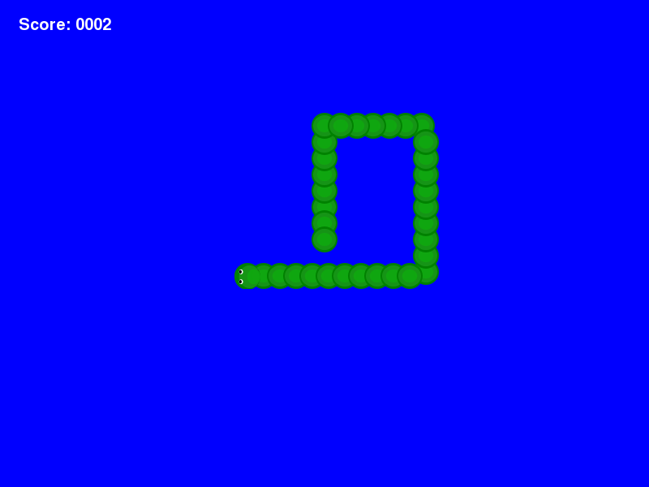
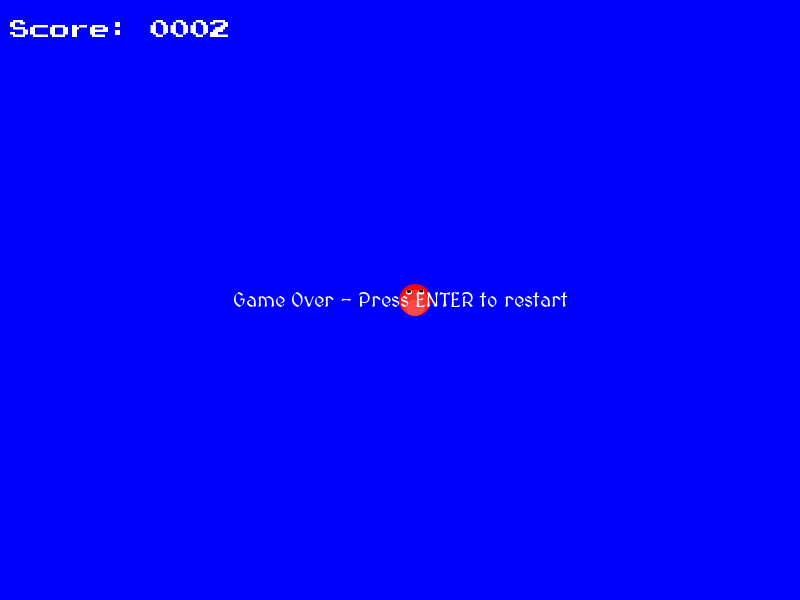
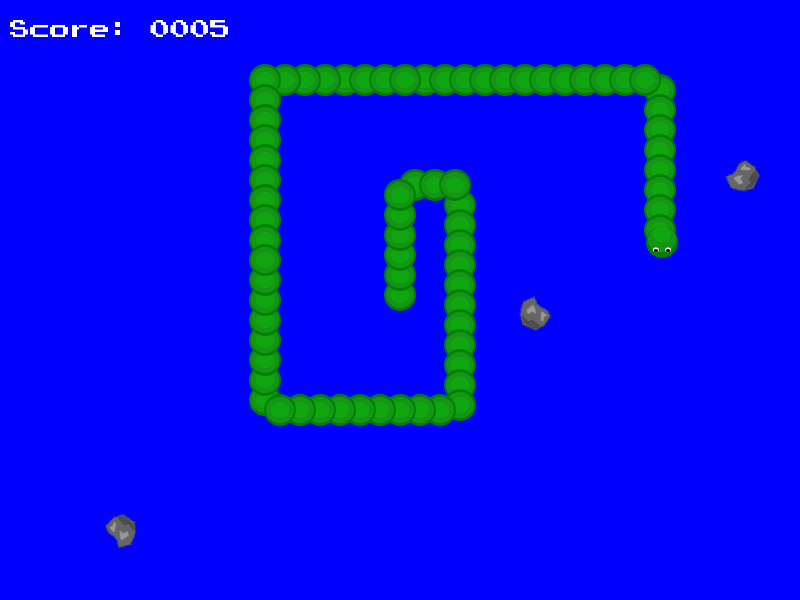
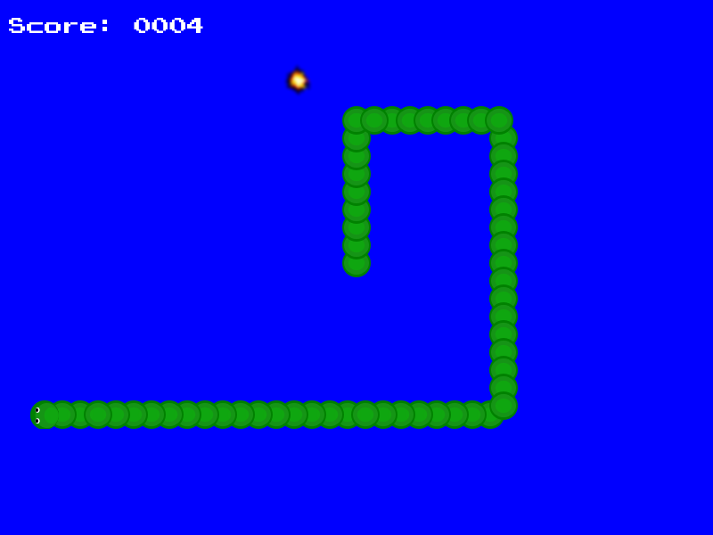
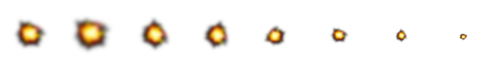

Tutorial 2: Snake Part 2
========================

.. contents::

This tutorial continues on from :doc:`tutorial-1`.

The basic game is in place and we will now add sprites, sound, fonts, animation and events.

Adding Sprites
--------------

    
The game is working ok but we need to add some sprites to start to make it look like a 
real game. We will add a sprite for the head and one for the body.

To use sprites with serge you first need to register them in the sprite registry. You can
create simple sprites and animated sprites from single files (sprite sheets) or multiple
files. For the moment let's just stick with simple sprites.

To register a sprite you use code like this.

.. code-block:: python
    :linenos:

    import serge.visual
    serge.visual.Sprites.setPath('graphics')
    serge.visual.Sprites.registerItem('head', 'head.png')
    serge.visual.Sprites.registerItem('tail', 'tail.png')
    
It is best to put all sprites in a separate folder. You then use *setPath* to point serge
at the folder. Then you make repeated calls to *registerItem* to register each sprite. You
give the sprite a name and the file that you want to use.

Once you have registered a sprite you then use it for an actor's visual by calling the *setSpriteName*
method of the actor. For example.

.. code-block:: python
    :linenos:
    
    snake.setSpriteName('head')
    
Now the head sprite will be used.

Let's add that to our code now. You can download the graphics here (`zipfile`_).

.. code-block:: python
    :linenos:
    :emphasize-lines: 3, 19, 72, 97, 125-126, 142, 150-155
    
    import pygame

    import serge.visual
    import serge.engine
    import serge.actor
    import serge.blocks.visualblocks
    import serge.blocks.utils
    import serge.blocks.directions
    import serge.blocks.behaviours
    import serge.blocks.actors
        
    class Snake(serge.actor.CompositeActor):
        """Represents the snake"""
        
        def __init__(self):
            """Initialise the snake"""
            super(Snake, self).__init__('snake', 'snake-head')
            self.visual = serge.blocks.visualblocks.Circle(16, (0,255,0))
            self.setSpriteName('head')
            self.setLayerName('middle')
            self.current_direction = serge.blocks.directions.N
            self.is_dying = False

        def addedToWorld(self, world):
            """The snake was added to the world"""
            super(Snake, self).addedToWorld(world)
            #
            self.keyboard = serge.engine.CurrentEngine().getKeyboard()
            self.manager = serge.blocks.behaviours.BehaviourManager('manager', 'behaviour-manager')
            world.addActor(self.manager)
            #
            # Text to display when the game is over
            self.restart_text = serge.blocks.utils.addVisualActorToWorld(world, 'text', 'restart',
                serge.visual.Text('Game Over - Press ENTER to restart', (255, 255, 255), font_size=20),
                layer_name='front',
                center_position=(400, 300))
            self.restart_text.visible = False
            #
            # A background for the game
            self.bg = serge.blocks.utils.addVisualActorToWorld(world, 'bg', 'bg',
                serge.blocks.visualblocks.Rectangle((800, 600), (0,0,255)),
                layer_name='back',
                center_position=(400, 300))
            #
            # Text to show the score
            self.score = serge.blocks.utils.addActorToWorld(world, 
                serge.blocks.actors.NumericText('text', 'score', 'Score: %04d', 
                    (255, 255, 255), font_size=20, value=0, align='left'),
                layer_name='front',
                center_position=(80, 30))
            
        def updateActor(self, interval, world):
            """Update the snake"""
            super(Snake, self).updateActor(interval, world)
            #
            # Quit if requested
            if self.keyboard.isClicked(pygame.K_ESCAPE):
                serge.engine.CurrentEngine().stop()
            #
            # Move the head
            if self.keyboard.isClicked(pygame.K_LEFT):
                rotation = +90
            elif self.keyboard.isClicked(pygame.K_RIGHT):
                rotation = -90
            else:
                rotation = 0
            #
            # Change direction
            if rotation:
                current_angle = serge.blocks.directions.getAngleFromCardinal(self.current_direction)
                self.current_direction = serge.blocks.directions.getCardinalFromAngle(current_angle+rotation)
                self.visual.setAngle(current_angle+rotation)
            #
            # Move
            if not self.is_dying:
                offset = 5*serge.blocks.directions.getVectorFromCardinal(self.current_direction)
                self.move(*offset)
                #
                # Add a new segment if needed
                if not self.getChildren() or self.getDistanceFrom(self.getChildren()[-1]) > 16:
                    self.addSegment()
                #
                # Check if we hit the body
                if self.hitBody() or self.offScreen():
                    self.initiateDeathAnimation()
                #
                # Increase score
                self.score.value += interval/1000.0
            elif self.animation.isComplete():
                if self.keyboard.isClicked(pygame.K_KP_ENTER) or self.keyboard.isClicked(pygame.K_RETURN):
                    self.restartGame()
                
        def addSegment(self):
            """Add a new body segment"""
            segment = serge.actor.Actor('segment')
            segment.visual = serge.blocks.visualblocks.Circle(16, (0,200,0))
            segment.setSpriteName('tail')
            segment.setLayerName('middle')
            segment.moveTo(self.x, self.y)
            self.addChild(segment)

        def hitBody(self):
            """Return True if the head has hit the body
            
            Look to see if we overlap with any body segment except the last
            (we are allowed to overlap the last since we just put it down)
            
            """
            for segment in self.getChildren()[:-1]:
                if self.getDistanceFrom(segment) < 16:
                    return True
            return False
            
        def offScreen(self):
            """Return True if we are off the screen"""
            return self.x < 0 or self.x > 800 or self.y < 0 or self.y > 600
            
        def initiateDeathAnimation(self):
            """Begin showing the death of the snake"""
            self.log.info('Snake died!')
            self.animation = self.manager.assignBehaviour(self, 
                serge.blocks.behaviours.TimedCallback(1000/len(self.getChildren()), self.removeTail), 'death-animation')
            self.is_dying = True
            for segment in self.getChildren():
                segment.setSpriteName('red-tail')
            self.setSpriteName('red-head')
                
        def removeTail(self, world, actor, interval):
            """Remove part of the tail"""
            self.log.debug('Removing part of the tail')
            if self.getChildren():
                self.removeChild(self.getChildren()[0])
            else:
                self.animation.markComplete()
                self.restart_text.visible = True
        
        def restartGame(self):
            """Restart the game"""
            self.is_dying = False
            self.restart_text.visible = False
            self.setSpriteName('head')
            self.current_direction = serge.blocks.directions.N
            self.score.value = 0
            self.moveTo(400, 300)
            
    # Create the engine
    engine = serge.blocks.utils.getSimpleSetup(800, 600)
    world = engine.getWorld('lab')

    # Register sprites
    serge.visual.Sprites.setPath('graphics')
    serge.visual.Sprites.registerItem('head', 'head.png')
    serge.visual.Sprites.registerItem('tail', 'tail.png')
    serge.visual.Sprites.registerItem('red-head', 'red-head.png')
    serge.visual.Sprites.registerItem('red-tail', 'red-tail.png')

    # Create the snake
    snake = Snake()
    world.addActor(snake)
    snake.moveTo(400, 300)

    # Run the game
    engine.run(60)

We didn't have to make too many changes to get this to work. One thing we did do was to create
two sprites to represent the green and red states of the snake. We cannot just change the colour
like we did for the circle. You could create a multi-celled sprite to do this but it is just as
easy to use multiple sprites.

The other thing to notice is that we didn't have to make sprites for all the different orientations
of the head. We can just use the *setAngle* method of the sprite (the actor's *visual*) to rotate
the sprite in the right way.

Adding Sound
------------

Sound, like sprites, must be registered before you use it. The process is very similar as it uses
the same underlying *registry* approach as sprites.

To play a sound you use the following code,

.. code-block:: python
    :linenos:

    import serge.sound
    serge.sound.Sounds.setPath('sounds')
    serge.sound.Sounds.registerItem('new-body', 'bloop.wav')
    serge.sound.Sounds.play('new-body')
    #
    # Or...
    my_sound = serge.sound.Sounds.getItem('new-body')
    my_sound.play()
    

In our game we are going to make a sound whenever a new body piece is added and then a different one
when the snake dies. Since we have the death animation, the death sound is quite long. We use the
*fadeout* method of the sound to make sure that the death sound ends at approximately the same time as
the on-screen animation.

.. code-block:: python
    :linenos:
    :emphasize-lines: 4, 102, 129, 139, 161-164

    import pygame

    import serge.visual
    import serge.sound
    import serge.engine
    import serge.actor
    import serge.blocks.visualblocks
    import serge.blocks.utils
    import serge.blocks.directions
    import serge.blocks.behaviours
    import serge.blocks.actors
        
    class Snake(serge.actor.CompositeActor):
        """Represents the snake"""
        
        def __init__(self):
            """Initialise the snake"""
            super(Snake, self).__init__('snake', 'snake-head')
            self.visual = serge.blocks.visualblocks.Circle(16, (0,255,0))
            self.setSpriteName('head')
            self.setLayerName('middle')
            self.current_direction = serge.blocks.directions.N
            self.is_dying = False

        def addedToWorld(self, world):
            """The snake was added to the world"""
            super(Snake, self).addedToWorld(world)
            #
            self.keyboard = serge.engine.CurrentEngine().getKeyboard()
            self.manager = serge.blocks.behaviours.BehaviourManager('manager', 'behaviour-manager')
            world.addActor(self.manager)
            #
            # Text to display when the game is over
            self.restart_text = serge.blocks.utils.addVisualActorToWorld(world, 'text', 'restart',
                serge.visual.Text('Game Over - Press ENTER to restart', (255, 255, 255), font_size=20),
                layer_name='front',
                center_position=(400, 300))
            self.restart_text.visible = False
            #
            # A background for the game
            self.bg = serge.blocks.utils.addVisualActorToWorld(world, 'bg', 'bg',
                serge.blocks.visualblocks.Rectangle((800, 600), (0,0,255)),
                layer_name='back',
                center_position=(400, 300))
            #
            # Text to show the score
            self.score = serge.blocks.utils.addActorToWorld(world, 
                serge.blocks.actors.NumericText('text', 'score', 'Score: %04d', 
                    (255, 255, 255), font_size=20, value=0, align='left'),
                layer_name='front',
                center_position=(80, 30))
            
        def updateActor(self, interval, world):
            """Update the snake"""
            super(Snake, self).updateActor(interval, world)
            #
            # Quit if requested
            if self.keyboard.isClicked(pygame.K_ESCAPE):
                serge.engine.CurrentEngine().stop()
            #
            # Move the head
            if self.keyboard.isClicked(pygame.K_LEFT):
                rotation = +90
            elif self.keyboard.isClicked(pygame.K_RIGHT):
                rotation = -90
            else:
                rotation = 0
            #
            # Change direction
            if rotation:
                current_angle = serge.blocks.directions.getAngleFromCardinal(self.current_direction)
                self.current_direction = serge.blocks.directions.getCardinalFromAngle(current_angle+rotation)
                self.visual.setAngle(current_angle+rotation)
            #
            # Move
            if not self.is_dying:
                offset = 5*serge.blocks.directions.getVectorFromCardinal(self.current_direction)
                self.move(*offset)
                #
                # Add a new segment if needed
                if not self.getChildren() or self.getDistanceFrom(self.getChildren()[-1]) > 16:
                    self.addSegment()
                #
                # Check if we hit the body
                if self.hitBody() or self.offScreen():
                    self.initiateDeathAnimation()
                #
                # Increase score
                self.score.value += interval/1000.0
            elif self.animation.isComplete():
                if self.keyboard.isClicked(pygame.K_KP_ENTER) or self.keyboard.isClicked(pygame.K_RETURN):
                    self.restartGame()
                
        def addSegment(self):
            """Add a new body segment"""
            segment = serge.actor.Actor('segment')
            segment.visual = serge.blocks.visualblocks.Circle(16, (0,200,0))
            segment.setSpriteName('tail')
            segment.setLayerName('middle')
            segment.moveTo(self.x, self.y)
            self.addChild(segment)
            serge.sound.Sounds.play('new-body')

        def hitBody(self):
            """Return True if the head has hit the body
            
            Look to see if we overlap with any body segment except the last
            (we are allowed to overlap the last since we just put it down)
            
            """
            for segment in self.getChildren()[:-1]:
                if self.getDistanceFrom(segment) < 16:
                    return True
            return False
            
        def offScreen(self):
            """Return True if we are off the screen"""
            return self.x < 0 or self.x > 800 or self.y < 0 or self.y > 600
            
        def initiateDeathAnimation(self):
            """Begin showing the death of the snake"""
            self.log.info('Snake died!')
            self.animation = self.manager.assignBehaviour(self, 
                serge.blocks.behaviours.TimedCallback(1000/len(self.getChildren()), self.removeTail), 'death-animation')
            self.is_dying = True
            for segment in self.getChildren():
                segment.setSpriteName('red-tail')
            self.setSpriteName('red-head')
            serge.sound.Sounds.play('snake-death')
                
        def removeTail(self, world, actor, interval):
            """Remove part of the tail"""
            self.log.debug('Removing part of the tail')
            if self.getChildren():
                self.removeChild(self.getChildren()[0])
            else:
                self.animation.markComplete()
                self.restart_text.visible = True
                serge.sound.Sounds.getItem('snake-death').fadeout(500)    
                
        def restartGame(self):
            """Restart the game"""
            self.is_dying = False
            self.restart_text.visible = False
            self.setSpriteName('head')
            self.current_direction = serge.blocks.directions.N
            self.score.value = 0
            self.moveTo(400, 300)
            
    # Create the engine
    engine = serge.blocks.utils.getSimpleSetup(800, 600)
    world = engine.getWorld('lab')

    # Register sprites
    serge.visual.Sprites.setPath('graphics')
    serge.visual.Sprites.registerItem('head', 'head.png')
    serge.visual.Sprites.registerItem('tail', 'tail.png')
    serge.visual.Sprites.registerItem('red-head', 'red-head.png')
    serge.visual.Sprites.registerItem('red-tail', 'red-tail.png')

    # Register sounds
    serge.sound.Sounds.setPath('sounds')
    serge.sound.Sounds.registerItem('new-body', 'bloop.wav')
    serge.sound.Sounds.registerItem('snake-death', 'death.wav')

    # Create the snake
    snake = Snake()
    world.addActor(snake)
    snake.moveTo(400, 300)

    # Run the game
    engine.run(60)

Adding Fonts
------------

    
The default fonts in pygame are good but it adds a nice touch to include a custom font. The process for using fonts is very similar to sound and graphics. You need to register the font location, register a font and then you can refer to it subsequently by the registered name. 

.. code-block:: python
    :linenos:

    import serge.visual
    serge.visual.Fonts.setPath('fonts')
    serge.visual.Fonts.registerItem('DEFAULT', 'MedievalSharp.ttf')
    serge.visual.Fonts.registerItem('scores', 'PressStart2P.ttf')
    
You for fonts there is also a special name, *DEFAULT*. If you register a font with this name then this will be the one used by default for all text. 

We are using two fonts here, one for the main text and one for the scores. You probably don't need to do this in such a simple game but it allows us to see the difference between using the default font and a named font. All classes involving text take some kind of *font_name* parameter. If you do not pass anything then the default font is used. Alternatively you pass the name of a registered font and it will use that one.

Note that in the updated game we had to move the score text over a bit as the chosen font is larger than the default.

.. code-block:: python
    :linenos:
    :emphasize-lines: 47-51, 166-169
    
    import pygame

    import serge.visual
    import serge.sound
    import serge.engine
    import serge.actor
    import serge.blocks.visualblocks
    import serge.blocks.utils
    import serge.blocks.directions
    import serge.blocks.behaviours
    import serge.blocks.actors
        
    class Snake(serge.actor.CompositeActor):
        """Represents the snake"""
        
        def __init__(self):
            """Initialise the snake"""
            super(Snake, self).__init__('snake', 'snake-head')
            self.visual = serge.blocks.visualblocks.Circle(16, (0,255,0))
            self.setSpriteName('head')
            self.setLayerName('middle')
            self.current_direction = serge.blocks.directions.N
            self.is_dying = False

        def addedToWorld(self, world):
            """The snake was added to the world"""
            super(Snake, self).addedToWorld(world)
            #
            self.keyboard = serge.engine.CurrentEngine().getKeyboard()
            self.manager = serge.blocks.behaviours.BehaviourManager('manager', 'behaviour-manager')
            world.addActor(self.manager)
            #
            # Text to display when the game is over
            self.restart_text = serge.blocks.utils.addVisualActorToWorld(world, 'text', 'restart',
                serge.visual.Text('Game Over - Press ENTER to restart', (255, 255, 255), font_size=20),
                layer_name='front',
                center_position=(400, 300))
            self.restart_text.visible = False
            #
            # A background for the game
            self.bg = serge.blocks.utils.addVisualActorToWorld(world, 'bg', 'bg',
                serge.blocks.visualblocks.Rectangle((800, 600), (0,0,255)),
                layer_name='back',
                center_position=(400, 300))
            #
            # Text to show the score
            self.score = serge.blocks.utils.addActorToWorld(world, 
                serge.blocks.actors.NumericText('text', 'score', 'Score: %04d', 
                    (255, 255, 255), font_size=20, font_name='scores', value=0, align='left'),
                layer_name='front',
                center_position=(120, 30))
            
        def updateActor(self, interval, world):
            """Update the snake"""
            super(Snake, self).updateActor(interval, world)
            #
            # Quit if requested
            if self.keyboard.isClicked(pygame.K_ESCAPE):
                serge.engine.CurrentEngine().stop()
            #
            # Move the head
            if self.keyboard.isClicked(pygame.K_LEFT):
                rotation = +90
            elif self.keyboard.isClicked(pygame.K_RIGHT):
                rotation = -90
            else:
                rotation = 0
            #
            # Change direction
            if rotation:
                current_angle = serge.blocks.directions.getAngleFromCardinal(self.current_direction)
                self.current_direction = serge.blocks.directions.getCardinalFromAngle(current_angle+rotation)
                self.visual.setAngle(current_angle+rotation)
            #
            # Move
            if not self.is_dying:
                offset = 5*serge.blocks.directions.getVectorFromCardinal(self.current_direction)
                self.move(*offset)
                #
                # Add a new segment if needed
                if not self.getChildren() or self.getDistanceFrom(self.getChildren()[-1]) > 16:
                    self.addSegment()
                #
                # Check if we hit the body
                if self.hitBody() or self.offScreen():
                    self.initiateDeathAnimation()
                #
                # Increase score
                self.score.value += interval/1000.0
            elif self.animation.isComplete():
                if self.keyboard.isClicked(pygame.K_KP_ENTER) or self.keyboard.isClicked(pygame.K_RETURN):
                    self.restartGame()
                
        def addSegment(self):
            """Add a new body segment"""
            segment = serge.actor.Actor('segment')
            segment.visual = serge.blocks.visualblocks.Circle(16, (0,200,0))
            segment.setSpriteName('tail')
            segment.setLayerName('middle')
            segment.moveTo(self.x, self.y)
            self.addChild(segment)
            serge.sound.Sounds.play('new-body')

        def hitBody(self):
            """Return True if the head has hit the body
            
            Look to see if we overlap with any body segment except the last
            (we are allowed to overlap the last since we just put it down)
            
            """
            for segment in self.getChildren()[:-1]:
                if self.getDistanceFrom(segment) < 16:
                    return True
            return False
            
        def offScreen(self):
            """Return True if we are off the screen"""
            return self.x < 0 or self.x > 800 or self.y < 0 or self.y > 600
            
        def initiateDeathAnimation(self):
            """Begin showing the death of the snake"""
            self.log.info('Snake died!')
            self.animation = self.manager.assignBehaviour(self, 
                serge.blocks.behaviours.TimedCallback(1000/len(self.getChildren()), self.removeTail), 'death-animation')
            self.is_dying = True
            for segment in self.getChildren():
                segment.setSpriteName('red-tail')
            self.setSpriteName('red-head')
            serge.sound.Sounds.play('snake-death')
                
        def removeTail(self, world, actor, interval):
            """Remove part of the tail"""
            self.log.debug('Removing part of the tail')
            if self.getChildren():
                self.removeChild(self.getChildren()[0])
            else:
                self.animation.markComplete()
                self.restart_text.visible = True
                serge.sound.Sounds.getItem('snake-death').fadeout(500)    
                
        def restartGame(self):
            """Restart the game"""
            self.is_dying = False
            self.restart_text.visible = False
            self.setSpriteName('head')
            self.current_direction = serge.blocks.directions.N
            self.score.value = 0
            self.moveTo(400, 300)
            
    # Create the engine
    engine = serge.blocks.utils.getSimpleSetup(800, 600)
    world = engine.getWorld('lab')

    # Register sprites
    serge.visual.Sprites.setPath('graphics')
    serge.visual.Sprites.registerItem('head', 'head.png')
    serge.visual.Sprites.registerItem('tail', 'tail.png')
    serge.visual.Sprites.registerItem('red-head', 'red-head.png')
    serge.visual.Sprites.registerItem('red-tail', 'red-tail.png')

    # Register sounds
    serge.sound.Sounds.setPath('sounds')
    serge.sound.Sounds.registerItem('new-body', 'bloop.wav')
    serge.sound.Sounds.registerItem('snake-death', 'death.wav')

    # Register fonts
    serge.visual.Fonts.setPath('fonts')
    serge.visual.Fonts.registerItem('DEFAULT', 'MedievalSharp.ttf')
    serge.visual.Fonts.registerItem('scores', 'PressStart2P.ttf')

    # Create the snake
    snake = Snake()
    world.addActor(snake)
    snake.moveTo(400, 300)

    # Run the game
    engine.run(60)   

Additional Gameplay elements
----------------------------

    
Before exploring more of the game engine we need to add some more gameplay elements. 

Let's add a number of rocks to the screen. If the snake hits a rock then it is
going to die. But later we will allow the player to click on the rocks to blow them
up. 

First we need to add a rock graphic and then add some code to add it to the screen. We register
the rock graphic as before, with:

.. code-block:: python
    :linenos:

    serge.visual.Sprites.regsiterItem('rock', 'rock.png')
    
Then we will randomly add a rock to the screen every so often in the snakes *updateActor* method. We also
need to check if the snake has hit a rock. We do this in the same method.

When we add a rock we use the line:

.. code-block:: python
    :linenos:

    rock = serge.actor.Actor('rock')

The text *'rock'* here is the actor's *tag*. Tags are very useful and can be used to locate groups of actors in the world. In this case we are going to use it to later find out all the rocks that we have added without having to manually keep track.

Every actor has a tag and optionally can have a name. You can also find actors by names but names are assumed (but not forced) to be unique.

.. code-block:: python
    :linenos:

    rock = serge.actor.Actor('rock', 'rock-63')

The new code is as follows.

.. code-block:: python
    :linenos:
    :emphasize-lines: 1, 32, 81-84, 91, 109-117, 131-137, 172, 185
    
    import random
    import pygame

    import serge.visual
    import serge.sound
    import serge.engine
    import serge.actor
    import serge.blocks.visualblocks
    import serge.blocks.utils
    import serge.blocks.directions
    import serge.blocks.behaviours
    import serge.blocks.actors
        
    class Snake(serge.actor.CompositeActor):
        """Represents the snake"""
        
        def __init__(self):
            """Initialise the snake"""
            super(Snake, self).__init__('snake', 'snake-head')
            self.visual = serge.blocks.visualblocks.Circle(16, (0,255,0))
            self.setSpriteName('head')
            self.setLayerName('middle')
            self.current_direction = serge.blocks.directions.N
            self.is_dying = False

        def addedToWorld(self, world):
            """The snake was added to the world"""
            super(Snake, self).addedToWorld(world)
            #
            self.keyboard = serge.engine.CurrentEngine().getKeyboard()
            self.manager = serge.blocks.behaviours.BehaviourManager('manager', 'behaviour-manager')
            self.world = world
            world.addActor(self.manager)
            #
            # Text to display when the game is over
            self.restart_text = serge.blocks.utils.addVisualActorToWorld(world, 'text', 'restart',
                serge.visual.Text('Game Over - Press ENTER to restart', (255, 255, 255), font_size=20),
                layer_name='front',
                center_position=(400, 300))
            self.restart_text.visible = False
            #
            # A background for the game
            self.bg = serge.blocks.utils.addVisualActorToWorld(world, 'bg', 'bg',
                serge.blocks.visualblocks.Rectangle((800, 600), (0,0,255)),
                layer_name='back',
                center_position=(400, 300))
            #
            # Text to show the score
            self.score = serge.blocks.utils.addActorToWorld(world, 
                serge.blocks.actors.NumericText('text', 'score', 'Score: %04d', 
                    (255, 255, 255), font_size=20, font_name='scores', value=0, align='left'),
                layer_name='front',
                center_position=(120, 30))
            
        def updateActor(self, interval, world):
            """Update the snake"""
            super(Snake, self).updateActor(interval, world)
            #
            # Quit if requested
            if self.keyboard.isClicked(pygame.K_ESCAPE):
                serge.engine.CurrentEngine().stop()
            #
            # Move the head
            if self.keyboard.isClicked(pygame.K_LEFT):
                rotation = +90
            elif self.keyboard.isClicked(pygame.K_RIGHT):
                rotation = -90
            else:
                rotation = 0
            #
            # Change direction
            if rotation:
                current_angle = serge.blocks.directions.getAngleFromCardinal(self.current_direction)
                self.current_direction = serge.blocks.directions.getCardinalFromAngle(current_angle+rotation)
                self.visual.setAngle(current_angle+rotation)
            #
            # Move
            if not self.is_dying:
                offset = 5*serge.blocks.directions.getVectorFromCardinal(self.current_direction)
                self.move(*offset)
                #
                # Adding random rocks
                if random.random() < 0.01:
                    self.addRock()
                #
                # Add a new segment if needed
                if not self.getChildren() or self.getDistanceFrom(self.getChildren()[-1]) > 16:
                    self.addSegment()
                #
                # Check if we hit the body
                if self.hitBody() or self.offScreen() or self.hitRock():
                    self.initiateDeathAnimation()
                #
                # Increase score
                self.score.value += interval/1000.0
            elif self.animation.isComplete():
                if self.keyboard.isClicked(pygame.K_KP_ENTER) or self.keyboard.isClicked(pygame.K_RETURN):
                    self.restartGame()
                
        def addSegment(self):
            """Add a new body segment"""
            segment = serge.actor.Actor('segment')
            segment.setSpriteName('tail')
            segment.setLayerName('middle')
            segment.moveTo(self.x, self.y)
            self.addChild(segment)
            serge.sound.Sounds.play('new-body')

        def addRock(self):
            """Add a rock to the screen"""
            position = (random.randrange(0, 800), random.randrange(0, 600))
            rock = serge.actor.Actor('rock')
            rock.setSpriteName('rock')
            rock.setLayerName('middle')
            rock.moveTo(*position)
            rock.setAngle(random.randrange(0, 360))
            self.world.addActor(rock)

        def hitBody(self):
            """Return True if the head has hit the body
            
            Look to see if we overlap with any body segment except the last
            (we are allowed to overlap the last since we just put it down)
            
            """
            for segment in self.getChildren()[:-1]:
                if self.getDistanceFrom(segment) < 16:
                    return True
            return False
            
        def hitRock(self):
            """Return True if we hit a rock"""
            for rock in self.world.findActorsByTag('rock'):
                if self.getDistanceFrom(rock) < 16:
                    return True
            else:
                return False
                
        def offScreen(self):
            """Return True if we are off the screen"""
            return self.x < 0 or self.x > 800 or self.y < 0 or self.y > 600
            
        def initiateDeathAnimation(self):
            """Begin showing the death of the snake"""
            self.log.info('Snake died!')
            self.animation = self.manager.assignBehaviour(self, 
                serge.blocks.behaviours.TimedCallback(1000/len(self.getChildren()), self.removeTail), 'death-animation')
            self.is_dying = True
            for segment in self.getChildren():
                segment.setSpriteName('red-tail')
            self.setSpriteName('red-head')
            serge.sound.Sounds.play('snake-death')
                
        def removeTail(self, world, actor, interval):
            """Remove part of the tail"""
            self.log.debug('Removing part of the tail')
            if self.getChildren():
                self.removeChild(self.getChildren()[0])
            else:
                self.animation.markComplete()
                self.restart_text.visible = True
                serge.sound.Sounds.getItem('snake-death').fadeout(500)    
                
        def restartGame(self):
            """Restart the game"""
            self.is_dying = False
            self.restart_text.visible = False
            self.setSpriteName('head')
            self.current_direction = serge.blocks.directions.N
            self.score.value = 0
            self.moveTo(400, 300)
            self.world.clearActorsWithTags(['rock'])
            
            
    # Create the engine
    engine = serge.blocks.utils.getSimpleSetup(800, 600)
    world = engine.getWorld('lab')

    # Register sprites
    serge.visual.Sprites.setPath('graphics')
    serge.visual.Sprites.registerItem('head', 'head.png')
    serge.visual.Sprites.registerItem('tail', 'tail.png')
    serge.visual.Sprites.registerItem('red-head', 'red-head.png')
    serge.visual.Sprites.registerItem('red-tail', 'red-tail.png')
    serge.visual.Sprites.registerItem('rock', 'rock.png')

    # Register sounds
    serge.sound.Sounds.setPath('sounds')
    serge.sound.Sounds.registerItem('new-body', 'bloop.wav')
    serge.sound.Sounds.registerItem('snake-death', 'death.wav')

    # Register fonts
    serge.visual.Fonts.setPath('fonts')
    serge.visual.Fonts.registerItem('DEFAULT', 'MedievalSharp.ttf')
    serge.visual.Fonts.registerItem('scores', 'PressStart2P.ttf')

    # Create the snake
    snake = Snake()
    world.addActor(snake)
    snake.moveTo(400, 300)

    # Run the game
    engine.run(60)

Some things to note here:

* We store the *world* object in the *addActorToWorld* as we are going to use this a lot later. This is quite a common requirement and you will find that you often need to do this.
* We use the *world.findActorsByTags* method to locate all the rocks. We didn't need to use this for finding the tail segments because we stored these as children. We could have used a similar approach but it is often best not to store lists of actors but just to find them in the world by their tags. If you keep lists of actors hanging around then you need to keep them up to date when actors get added and removed from the world and the world does this anyway so it often isn't worth the minor speed improvement to keep the lists yourself.
* We again use the tags to help remove all the rocks from the world when we are restarting (*world.clearActorsWithTags*)

Events
------

Ok, so now we have rocks being added to the screen and we have to dodge them. Let's allow the user to blow them up by clicking on them.

To do this we can use the event and notification system. You can link many game events to your own functions to easily react when something happens. In this case we want to do something when the user clicks the mouse on a rock.

.. code-block:: python
    :linenos:

    rock.linkEvent(serge.events.E_LEFT_CLICK, self.destroyRock, rock)
    
Our method *destroyRock*, which we havent' written yet, will be called whenever the user clicks on a rock. There are many different kinds of events. You can look at these in the :mod:`serge.events` module. You can be notified when actors are added or removed from the world or when worlds are activated or deactivated. You can even create your own events and use these to trigger actions like starting a new game.

We pass rock as an additional parameter to *linkEvent* because the event callback (*destroyRock*) will be called as *destroyRock(obj, arg)* with *obj* being the object involved in the event and *arg* being the final parameter in the *linkEvent* call. In the case of *E_LEFT_CLICK* the *obj* parameter is the *mouse* object and we really want to know which rock was clicked on so we pass this as the *arg* parameter. 

For some events you do not need this and you can omit the *arg* parameter.

The new code is below. Try it out and try clicking on the rocks as they appear.

.. code-block:: python
    :linenos:
    :emphasize-lines: 117, 165-167

    import random
    import pygame

    import serge.visual
    import serge.sound
    import serge.engine
    import serge.actor
    import serge.blocks.visualblocks
    import serge.blocks.utils
    import serge.blocks.directions
    import serge.blocks.behaviours
    import serge.blocks.actors
        
    class Snake(serge.actor.CompositeActor):
        """Represents the snake"""
        
        def __init__(self):
            """Initialise the snake"""
            super(Snake, self).__init__('snake', 'snake-head')
            self.visual = serge.blocks.visualblocks.Circle(16, (0,255,0))
            self.setSpriteName('head')
            self.setLayerName('middle')
            self.current_direction = serge.blocks.directions.N
            self.is_dying = False

        def addedToWorld(self, world):
            """The snake was added to the world"""
            super(Snake, self).addedToWorld(world)
            #
            self.keyboard = serge.engine.CurrentEngine().getKeyboard()
            self.manager = serge.blocks.behaviours.BehaviourManager('manager', 'behaviour-manager')
            self.world = world
            world.addActor(self.manager)
            #
            # Text to display when the game is over
            self.restart_text = serge.blocks.utils.addVisualActorToWorld(world, 'text', 'restart',
                serge.visual.Text('Game Over - Press ENTER to restart', (255, 255, 255), font_size=20),
                layer_name='front',
                center_position=(400, 300))
            self.restart_text.visible = False
            #
            # A background for the game
            self.bg = serge.blocks.utils.addVisualActorToWorld(world, 'bg', 'bg',
                serge.blocks.visualblocks.Rectangle((800, 600), (0,0,255)),
                layer_name='back',
                center_position=(400, 300))
            #
            # Text to show the score
            self.score = serge.blocks.utils.addActorToWorld(world, 
                serge.blocks.actors.NumericText('text', 'score', 'Score: %04d', 
                    (255, 255, 255), font_size=20, font_name='scores', value=0, align='left'),
                layer_name='front',
                center_position=(120, 30))
            
        def updateActor(self, interval, world):
            """Update the snake"""
            super(Snake, self).updateActor(interval, world)
            #
            # Quit if requested
            if self.keyboard.isClicked(pygame.K_ESCAPE):
                serge.engine.CurrentEngine().stop()
            #
            # Move the head
            if self.keyboard.isClicked(pygame.K_LEFT):
                rotation = +90
            elif self.keyboard.isClicked(pygame.K_RIGHT):
                rotation = -90
            else:
                rotation = 0
            #
            # Change direction
            if rotation:
                current_angle = serge.blocks.directions.getAngleFromCardinal(self.current_direction)
                self.current_direction = serge.blocks.directions.getCardinalFromAngle(current_angle+rotation)
                self.visual.setAngle(current_angle+rotation)
            #
            # Move
            if not self.is_dying:
                offset = 5*serge.blocks.directions.getVectorFromCardinal(self.current_direction)
                self.move(*offset)
                #
                # Adding random rocks
                if random.random() < 0.01:
                    self.addRock()
                #
                # Add a new segment if needed
                if not self.getChildren() or self.getDistanceFrom(self.getChildren()[-1]) > 16:
                    self.addSegment()
                #
                # Check if we hit the body
                if self.hitBody() or self.offScreen() or self.hitRock():
                    self.initiateDeathAnimation()
                #
                # Increase score
                self.score.value += interval/1000.0
            elif self.animation.isComplete():
                if self.keyboard.isClicked(pygame.K_KP_ENTER) or self.keyboard.isClicked(pygame.K_RETURN):
                    self.restartGame()
                
        def addSegment(self):
            """Add a new body segment"""
            segment = serge.actor.Actor('segment')
            segment.setSpriteName('tail')
            segment.setLayerName('middle')
            segment.moveTo(self.x, self.y)
            self.addChild(segment)
            serge.sound.Sounds.play('new-body')

        def addRock(self):
            """Add a rock to the screen"""
            position = (random.randrange(0, 800), random.randrange(0, 600))
            rock = serge.actor.Actor('rock')
            rock.setSpriteName('rock')
            rock.setLayerName('middle')
            rock.moveTo(*position)
            rock.setAngle(random.randrange(0, 360))
            rock.linkEvent(serge.events.E_LEFT_CLICK, self.destroyRock, rock)
            self.world.addActor(rock)

        def hitBody(self):
            """Return True if the head has hit the body
            
            Look to see if we overlap with any body segment except the last
            (we are allowed to overlap the last since we just put it down)
            
            """
            for segment in self.getChildren()[:-1]:
                if self.getDistanceFrom(segment) < 16:
                    return True
            return False
            
        def hitRock(self):
            """Return True if we hit a rock"""
            for rock in self.world.findActorsByTag('rock'):
                if self.getDistanceFrom(rock) < 16:
                    return True
            else:
                return False
                
        def offScreen(self):
            """Return True if we are off the screen"""
            return self.x < 0 or self.x > 800 or self.y < 0 or self.y > 600
            
        def initiateDeathAnimation(self):
            """Begin showing the death of the snake"""
            self.log.info('Snake died!')
            self.animation = self.manager.assignBehaviour(self, 
                serge.blocks.behaviours.TimedCallback(1000/len(self.getChildren()), self.removeTail), 'death-animation')
            self.is_dying = True
            for segment in self.getChildren():
                segment.setSpriteName('red-tail')
            self.setSpriteName('red-head')
            serge.sound.Sounds.play('snake-death')
                
        def removeTail(self, world, actor, interval):
            """Remove part of the tail"""
            self.log.debug('Removing part of the tail')
            if self.getChildren():
                self.removeChild(self.getChildren()[0])
            else:
                self.animation.markComplete()
                self.restart_text.visible = True
                serge.sound.Sounds.getItem('snake-death').fadeout(500)    
        
        def destroyRock(self, obj, rock):
            """Destroy a rock"""
            self.world.removeActor(rock)
            
        def restartGame(self):
            """Restart the game"""
            self.is_dying = False
            self.restart_text.visible = False
            self.setSpriteName('head')
            self.current_direction = serge.blocks.directions.N
            self.score.value = 0
            self.moveTo(400, 300)
            self.world.clearActorsWithTags(['rock'])
            
            
    # Create the engine
    engine = serge.blocks.utils.getSimpleSetup(800, 600)
    world = engine.getWorld('lab')

    # Register sprites
    serge.visual.Sprites.setPath('graphics')
    serge.visual.Sprites.registerItem('head', 'head.png')
    serge.visual.Sprites.registerItem('tail', 'tail.png')
    serge.visual.Sprites.registerItem('red-head', 'red-head.png')
    serge.visual.Sprites.registerItem('red-tail', 'red-tail.png')
    serge.visual.Sprites.registerItem('rock', 'rock.png')

    # Register sounds
    serge.sound.Sounds.setPath('sounds')
    serge.sound.Sounds.registerItem('new-body', 'bloop.wav')
    serge.sound.Sounds.registerItem('snake-death', 'death.wav')

    # Register fonts
    serge.visual.Fonts.setPath('fonts')
    serge.visual.Fonts.registerItem('DEFAULT', 'MedievalSharp.ttf')
    serge.visual.Fonts.registerItem('scores', 'PressStart2P.ttf')

    # Create the snake
    snake = Snake()
    world.addActor(snake)
    snake.moveTo(400, 300)

    # Run the game
    engine.run(60)

Animation
---------

Clicking on the rock makes it go away but it doesn't really feel like it is exploding. Let's add a bit of animation to that by having an explosion occur.

Animations are just sprites that have a number of cells. Each cell of the animation will play for a certain length of time and then the animation will move on to the next cell. You can create cells of animation either from a single file or from multiple files. For this example we will use a single file where the cells of animation are arranged horizontally.

Here is our file.

    
To register this as a sprite we use:

.. code-block:: python
    :linenos:
    
    serge.visual.Sprites.registerItem('explosion', 'explosion.png', zoom=0.25,
        w=8, framerate=10, running=True, loop=False, one_direction=True)
    
The framerate sets the number of cells that will be displayed per second. We do not want this animation to loop around and we only want it to go in one direction, ie we want it to run to the end of the animation and then stop. This particular graphic is actually quite large so we also use the *zoom* argument to scale it down a bit.

We want to add the animation to the screen whenever we destroy a rock. There is a useful *block* called an *AnimateThenDie* actor that we can use for this purpose. This is an actor that we place in the world and it will run its animation one and then be removed. This actor is ideal for explosions because we just want them to show and then go away. Look in the *destroyRock* method to see how we use this actor.

.. code-block:: python
    :linenos:
    :emphasize-lines: 168-170, 194-195

    import random
    import pygame

    import serge.visual
    import serge.sound
    import serge.engine
    import serge.actor
    import serge.blocks.visualblocks
    import serge.blocks.utils
    import serge.blocks.directions
    import serge.blocks.behaviours
    import serge.blocks.actors
        
    class Snake(serge.actor.CompositeActor):
        """Represents the snake"""
        
        def __init__(self):
            """Initialise the snake"""
            super(Snake, self).__init__('snake', 'snake-head')
            self.visual = serge.blocks.visualblocks.Circle(16, (0,255,0))
            self.setSpriteName('head')
            self.setLayerName('middle')
            self.current_direction = serge.blocks.directions.N
            self.is_dying = False

        def addedToWorld(self, world):
            """The snake was added to the world"""
            super(Snake, self).addedToWorld(world)
            #
            self.keyboard = serge.engine.CurrentEngine().getKeyboard()
            self.manager = serge.blocks.behaviours.BehaviourManager('manager', 'behaviour-manager')
            self.world = world
            world.addActor(self.manager)
            #
            # Text to display when the game is over
            self.restart_text = serge.blocks.utils.addVisualActorToWorld(world, 'text', 'restart',
                serge.visual.Text('Game Over - Press ENTER to restart', (255, 255, 255), font_size=20),
                layer_name='front',
                center_position=(400, 300))
            self.restart_text.visible = False
            #
            # A background for the game
            self.bg = serge.blocks.utils.addVisualActorToWorld(world, 'bg', 'bg',
                serge.blocks.visualblocks.Rectangle((800, 600), (0,0,255)),
                layer_name='back',
                center_position=(400, 300))
            #
            # Text to show the score
            self.score = serge.blocks.utils.addActorToWorld(world, 
                serge.blocks.actors.NumericText('text', 'score', 'Score: %04d', 
                    (255, 255, 255), font_size=20, font_name='scores', value=0, align='left'),
                layer_name='front',
                center_position=(120, 30))
            
        def updateActor(self, interval, world):
            """Update the snake"""
            super(Snake, self).updateActor(interval, world)
            #
            # Quit if requested
            if self.keyboard.isClicked(pygame.K_ESCAPE):
                serge.engine.CurrentEngine().stop()
            #
            # Move the head
            if self.keyboard.isClicked(pygame.K_LEFT):
                rotation = +90
            elif self.keyboard.isClicked(pygame.K_RIGHT):
                rotation = -90
            else:
                rotation = 0
            #
            # Change direction
            if rotation:
                current_angle = serge.blocks.directions.getAngleFromCardinal(self.current_direction)
                self.current_direction = serge.blocks.directions.getCardinalFromAngle(current_angle+rotation)
                self.visual.setAngle(current_angle+rotation)
            #
            # Move
            if not self.is_dying:
                offset = 5*serge.blocks.directions.getVectorFromCardinal(self.current_direction)
                self.move(*offset)
                #
                # Adding random rocks
                if random.random() < 0.01:
                    self.addRock()
                #
                # Add a new segment if needed
                if not self.getChildren() or self.getDistanceFrom(self.getChildren()[-1]) > 16:
                    self.addSegment()
                #
                # Check if we hit the body
                if self.hitBody() or self.offScreen() or self.hitRock():
                    self.initiateDeathAnimation()
                #
                # Increase score
                self.score.value += interval/1000.0
            elif self.animation.isComplete():
                if self.keyboard.isClicked(pygame.K_KP_ENTER) or self.keyboard.isClicked(pygame.K_RETURN):
                    self.restartGame()
                
        def addSegment(self):
            """Add a new body segment"""
            segment = serge.actor.Actor('segment')
            segment.setSpriteName('tail')
            segment.setLayerName('middle')
            segment.moveTo(self.x, self.y)
            self.addChild(segment)
            serge.sound.Sounds.play('new-body')

        def addRock(self):
            """Add a rock to the screen"""
            position = (random.randrange(0, 800), random.randrange(0, 600))
            rock = serge.actor.Actor('rock')
            rock.setSpriteName('rock')
            rock.setLayerName('middle')
            rock.moveTo(*position)
            rock.setAngle(random.randrange(0, 360))
            rock.linkEvent(serge.events.E_LEFT_CLICK, self.destroyRock, rock)
            self.world.addActor(rock)

        def hitBody(self):
            """Return True if the head has hit the body
            
            Look to see if we overlap with any body segment except the last
            (we are allowed to overlap the last since we just put it down)
            
            """
            for segment in self.getChildren()[:-1]:
                if self.getDistanceFrom(segment) < 16:
                    return True
            return False
            
        def hitRock(self):
            """Return True if we hit a rock"""
            for rock in self.world.findActorsByTag('rock'):
                if self.getDistanceFrom(rock) < 16:
                    return True
            else:
                return False
                
        def offScreen(self):
            """Return True if we are off the screen"""
            return self.x < 0 or self.x > 800 or self.y < 0 or self.y > 600
            
        def initiateDeathAnimation(self):
            """Begin showing the death of the snake"""
            self.log.info('Snake died!')
            self.animation = self.manager.assignBehaviour(self, 
                serge.blocks.behaviours.TimedCallback(1000/len(self.getChildren()), self.removeTail), 'death-animation')
            self.is_dying = True
            for segment in self.getChildren():
                segment.setSpriteName('red-tail')
            self.setSpriteName('red-head')
            serge.sound.Sounds.play('snake-death')
                
        def removeTail(self, world, actor, interval):
            """Remove part of the tail"""
            self.log.debug('Removing part of the tail')
            if self.getChildren():
                self.removeChild(self.getChildren()[0])
            else:
                self.animation.markComplete()
                self.restart_text.visible = True
                serge.sound.Sounds.getItem('snake-death').fadeout(500)    
        
        def destroyRock(self, obj, rock):
            """Destroy a rock"""
            self.world.removeActor(rock)
            explosion = serge.blocks.actors.AnimateThenDieActor('explosion', 'explosion', 'explosion', 'front')
            explosion.moveTo(rock.x, rock.y)
            self.world.addActor(explosion)
            
        def restartGame(self):
            """Restart the game"""
            self.is_dying = False
            self.restart_text.visible = False
            self.setSpriteName('head')
            self.current_direction = serge.blocks.directions.N
            self.score.value = 0
            self.moveTo(400, 300)
            self.world.clearActorsWithTags(['rock'])
            
            
    # Create the engine
    engine = serge.blocks.utils.getSimpleSetup(800, 600)
    world = engine.getWorld('lab')

    # Register sprites
    serge.visual.Sprites.setPath('graphics')
    serge.visual.Sprites.registerItem('head', 'head.png')
    serge.visual.Sprites.registerItem('tail', 'tail.png')
    serge.visual.Sprites.registerItem('red-head', 'red-head.png')
    serge.visual.Sprites.registerItem('red-tail', 'red-tail.png')
    serge.visual.Sprites.registerItem('rock', 'rock.png')
    serge.visual.Sprites.registerItem('explosion', 'explosion.png', zoom=0.25,
            w=8, framerate=10, running=True, loop=False, one_direction=True)
            
    # Register sounds
    serge.sound.Sounds.setPath('sounds')
    serge.sound.Sounds.registerItem('new-body', 'bloop.wav')
    serge.sound.Sounds.registerItem('snake-death', 'death.wav')

    # Register fonts
    serge.visual.Fonts.setPath('fonts')
    serge.visual.Fonts.registerItem('DEFAULT', 'MedievalSharp.ttf')
    serge.visual.Fonts.registerItem('scores', 'PressStart2P.ttf')

    # Create the snake
    snake = Snake()
    world.addActor(snake)
    snake.moveTo(400, 300)

    # Run the game
    engine.run(60)

Conclusion
----------

This concludes the snake tutorial. We have the basics of a playable game and covered the main fundamental concepts. We covered the following classes - take a look at their detailed documentation.

* :py:mod:`The Engine <engine>`
* :py:mod:`Worlds <world>`
* :py:mod:`Actors <actor>`
* :py:mod:`Sprites <visual>`
* :py:mod:`Sound <sound>`
* :py:mod:`Fonts <visual>`
* :py:mod:`Useful Blocks <usefulblocks>`

Return to the :doc:`tutorial` page for more advanced tutorial topics.

Resources
---------

Here are the graphics, sounds and fonts needed for the game: `zipfile`_

Credits
-------

* http://www.freesound.org/people/Greencouch/sounds/124909
* http://www.freesound.org/people/suonho/sounds/3375
* http://openfontlibrary.org/en/font/press-start-2p
* http://openfontlibrary.org/en/font/medievalsharp

.. _zipfile: _static/snake-tutorial.zip

